# AVALON
This folder contains the sources and binaries of AVALON for Atari ST/TT computers.

## Some screenshots

Der Hauptbildschirm von AVALON, der &quot;besten&quot; :-) Pointshell für alle TOS/GEM kompatibelen Rechner:

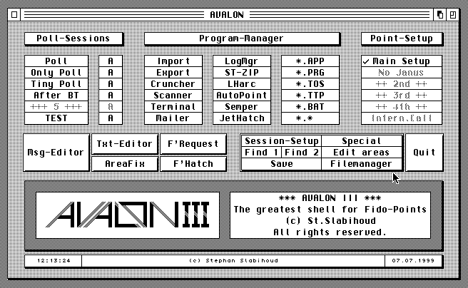

Im folgenden Fenster werden alle Einstellungen festgelegt:

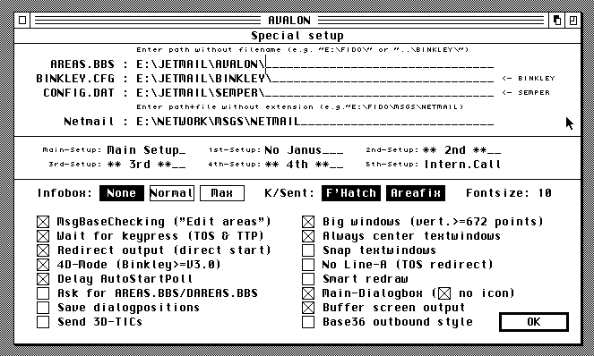

Vollautomatische Pollsessions werden hier konfiguriert:

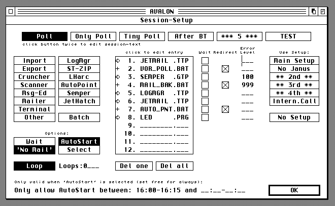

Nachrichtenbretter werden komfortabel mit dem Areafix-Manager (ab-)bestellt und ggf. auch automatisch
eingerichtet:

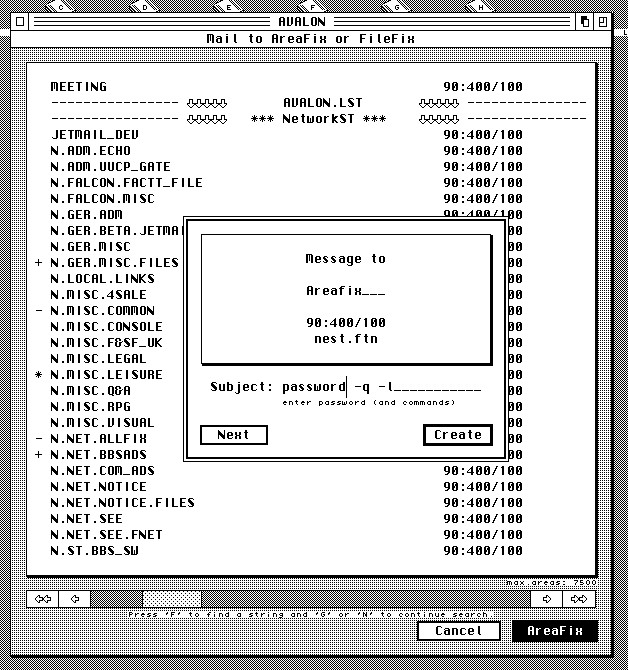

Zusätzliche Optionen für die Nachrichtenbretter werden hier bearbeitet:

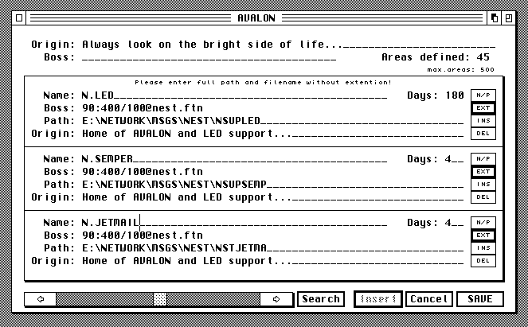

Statistiken geben Auskunft über das gesamte System, z.B. die MsgBase:

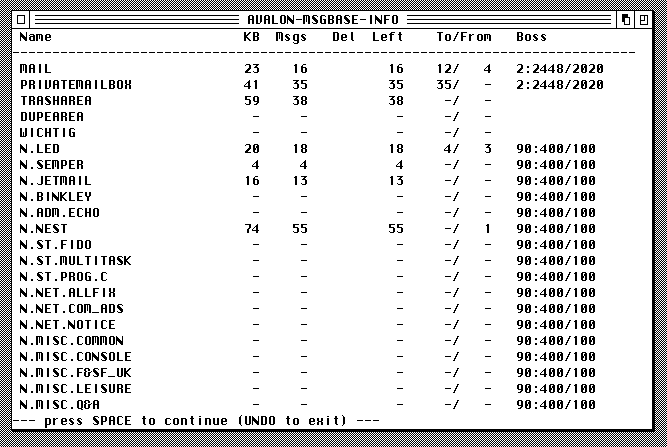

Hier eine kleine Statistik über noch nicht gesendete Mails:

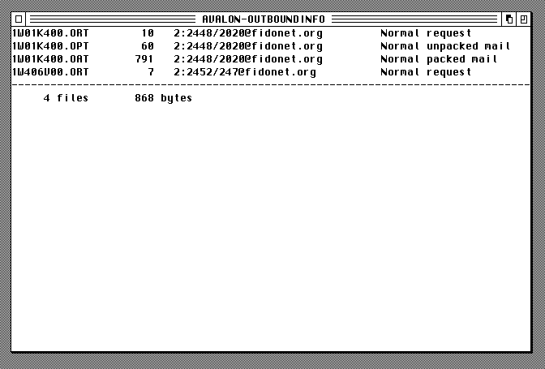

TOS-Programme laufen natürlich im Fenster ab (auch ohne MultiTOS). Dazu hängt sich AVALON in das System
ein und lenkt alle Ausgaben in ein Fenster um (natürlich voll VT-52 kompatibel):

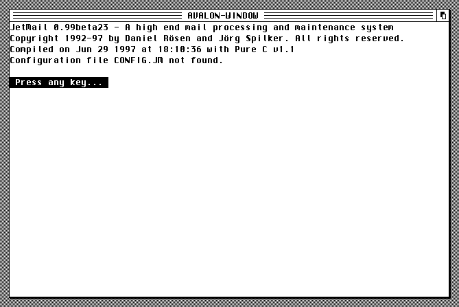

AVALON verfügt über ein eingebautes Terminalprogramm mit VT-52 und VT-100 Support (einige Features 
von anderen VT-xxx Emulationen sind zusätzlich vorhanden):

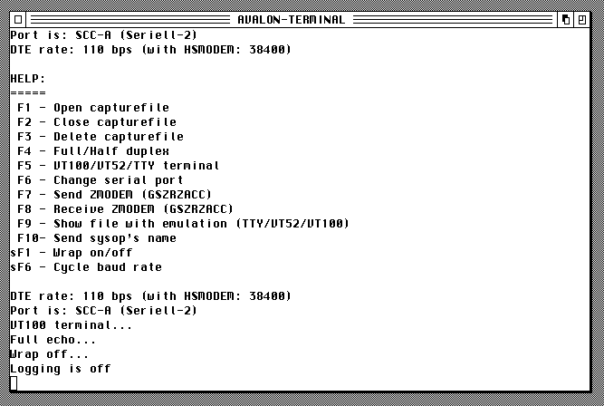

Files können bequem mit dem FileRequest-Manager angefprdert werden:

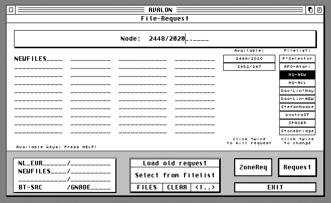

...und wer Dateien ins Netz stellen möchte, kann den eingebauten Hatcher/Ticker benutzen:

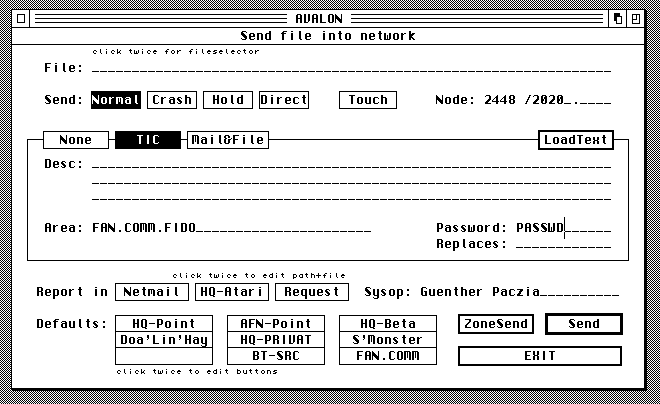

