# LED
This folder contains the sources and binaries of LED for Atari ST/TT computers.

## Some screenshots

Der Hauptbildschirm von LED, dem besten (und einzigen) Fido-MsgReader für TOS/GEM kompatible Rechner:

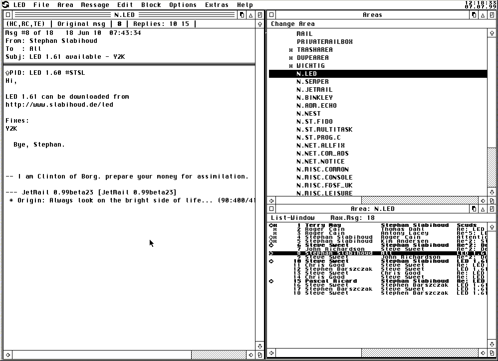

Wer keine Fenster mag, kann praktisch alles auch auf herkömmliche Dialoge umschalten:

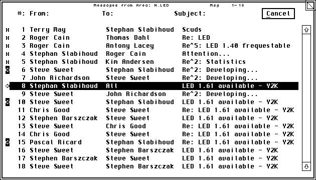

LED unterstützt ASCII Text-Effekte, die auch verschachtelt verwendet werden können:

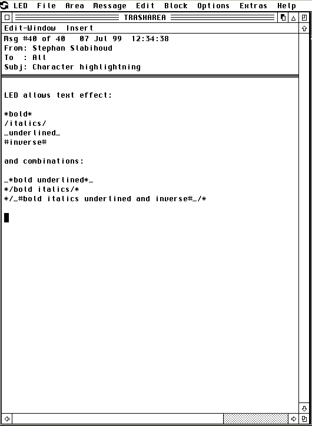

Hier das Ergebnis:

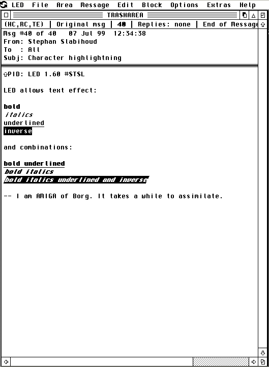

Der Optionen-Dialog von LED. Hier wird u.a. auch festgelegt, ob LED auch MIME-Kodierungen automatisch
erkennen und korrekt anzeigen soll (praktisch für Usenet Areas):

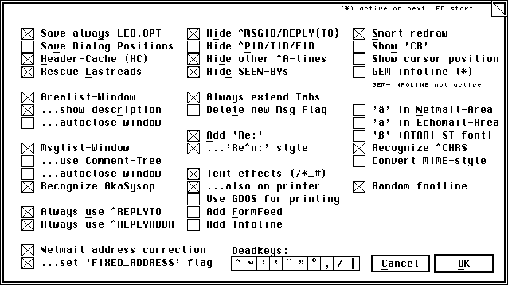

Das Quoten von Nachrichten kann frei konfigueriert werden. Tearlines (auch zufällig aus einem Pool
ausgewählt und für jede Nachrichtenarea frei konfigurierbar) werden ebenfalls automatisch erzeugt:

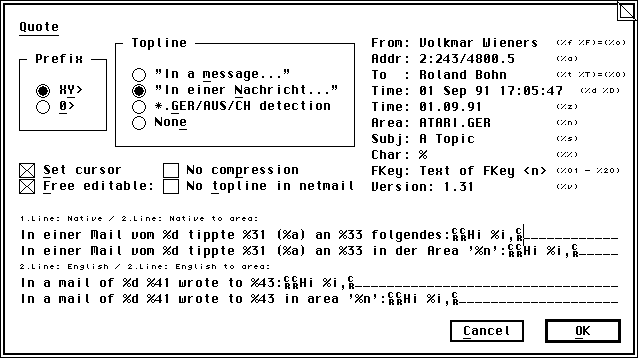

Alle FTSC-MsgFlags können manipuliert werden, sowie alle Flags der bekannten Tosser (JetMail, IOSmail,
ECU/Llegada):

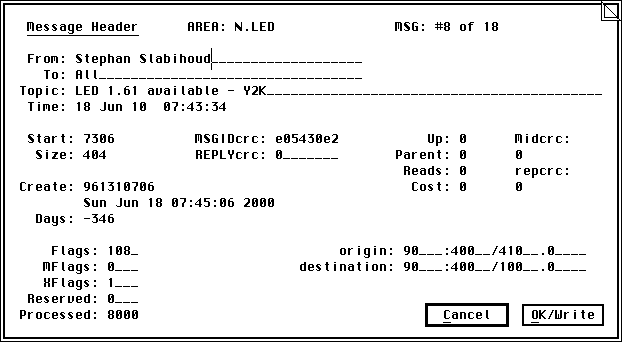

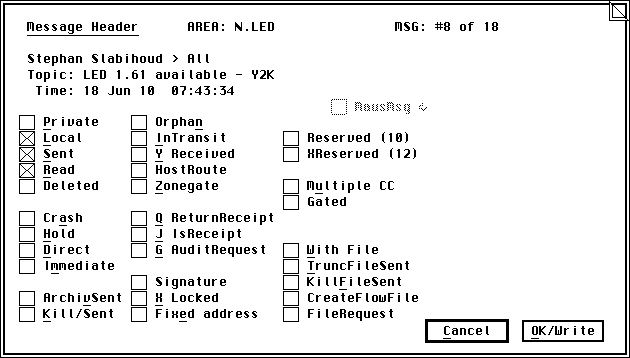

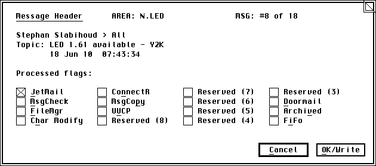

LED unterstützt auch andere Fonts:

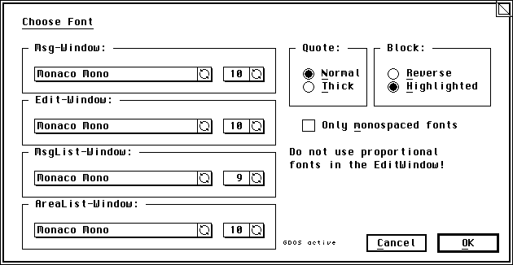

Die Shortcuts erlauben es nicht nur kurze Begriffe in den Text einzufügen, sondern auch ganze Textbausteine
und auch Dateien:

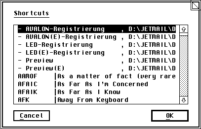

LED kann Nachrichtenthreads anzeigen. In einem Fenster werden alle Threads angezeigt, in der Titelleiste
der aktuelle Thread:

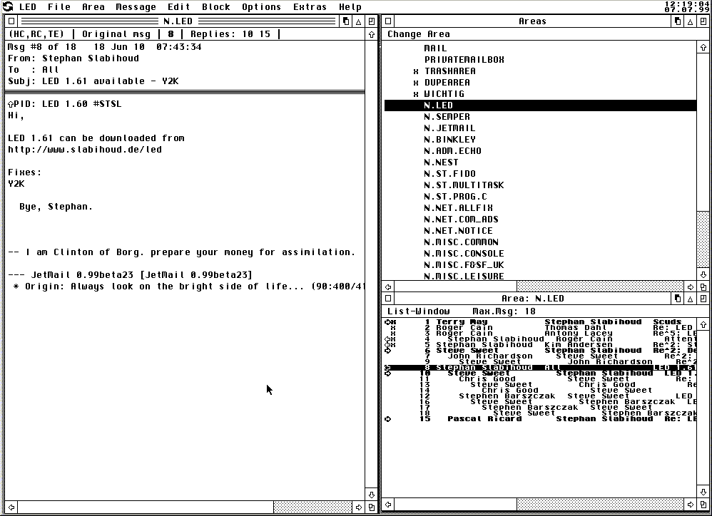

